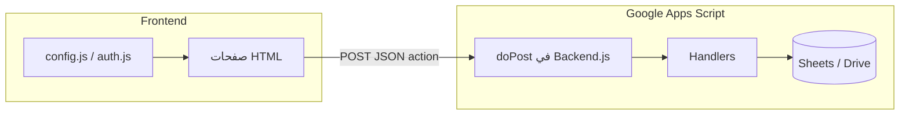
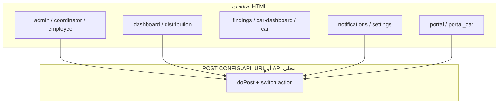

# architecture.md — هيكل النظام وتقرير التدقيق الفني (Deep Audit)

**المشروع:** IAG-System-2026  
**تاريخ التقرير:** 2026-04-12  
**نطاق الفحص:** مجلدا `Frontend/` و `Backend/` (قراءة فقط للكود؛ لم يُجرَ أي تعديل على ملفاتهما أثناء هذا التدقيق).

---

## 1. نظرة عامة مختصرة

| الطبقة | التقنية | الموقع |
|--------|---------|--------|
| الواجهة | HTML + CSS + JS | `Frontend/` و `Frontend/assets/` |
| الخلفية | Google Apps Script (Web App) | `Backend/` |
| البيانات | Google Sheets / Drive | خارج المستودع |

**تدفق عام:**

---

## 2. الواجهة الأمامية (Frontend)

### 2.1 تكرار CSS وهيكلة الأنماط

- **ملفات مركزية:** `assets/css/theme.css` (متغيرات `:root` + `.page-header` بخلفية `#0f172a` وتدرجات)،`assets/css/iag-theme.css` (يحدد الهيدر `#0a5c56` وفق هوية المشروع)،`assets/css/styles.css` (**لا يُستورد من أي صفحة HTML** — يبدو غير مستخدم حالياً).
- **ازدواجية مصدر الحقيقة:** تعليق في `theme.css` يطلب عدم تكرار القواعد في `<style>` داخل الصفحات، بينما **جميع صفحات HTML الرئيسية** تحتوي بلوكات `<style>` كبيرة (تكرار لأنماط الهيدر، الأزرار، البطاقات، القوائم الجانبية، إلخ).
- **صفحات بلا `iag-theme.css`:** تعتمد فقط على `theme.css` + أنماط داخلية، فتختلف هوية الهيدر عن الصفحات التي تربط `iag-theme.css` معاً (مثلاً `index.html`, `portal.html`, `coordinator.html`, `car-dashboard.html`, `car.html`, `portal_car.html`).
- **`card.css` في جذر `Frontend/`:** يُستورد من `employee.html` فقط؛ بقية الصفحات لا تعيد استخدامه — تشتت مسار الأصول (جذر المشروع مقابل `assets/css/`).

### 2.2 JavaScript داخل HTML (Inline) — ما يجدر بفصله

كل الصفحات التالية تضم `` ثم تحميل مكتبات ومحتوى قد لا يُنفَّذ — يستحق توحيد مسار التوجيه.
- `portal_car.html`: يعتمد على `const API = localStorage.getItem('iag_api_url')` — إن لم يُضبط المفتاح يبقى الطلب إلى سلسلة فارغة (سلوك هش مقارنةً بـ `CONFIG.API_URL` في بقية التطبيق).

### 2.3 ملفات JS/CSS يُشتبه في عدم استخدامها من الواجهة

- `Frontend/restyle.js`, `Frontend/sw.js`: لا تظهر مراجع إليهما من HTML أو `manifest.json` في نطاق الفحص.
- `Frontend/card.js`: لا يوجد `<script src="card.js">`؛ يبدو أن المنطق مكرر/مدمج في الصفحات (تعليقات تشير إلى «hooks من card.js» في `employee.html` / `coordinator.html`).

---

## 3. هوية التصميم (UI/UX) والتناقضات

### 3.1 تعارض مع قاعدة المشروع (لون الهيدر `#0a5c56`)

قاعدة `CLAUDE.md` تفرض لون الهيدر الموحد `#0a5c56`. الرصد:

- **`iag-theme.css`** يطبق `.page-header` و `.side-menu-header` بـ `#0a5c56` — متسق مع القاعدة عندما تُحمَّل الصفحة بهذا الملف.
- **`theme.css`** يعرّف `.page-header` بخلفية **`#0f172a`** وتدرجات — يتقدم على/يختلط مع `iag-theme.css` حسب ترتيب الربط.
- **صفحات/مكوّنات بألوان هيدر أخرى (ليست `#0a5c56`):**
  - `index.html` — `.header-bg`: `#0f172a` + تدرجات.
  - `portal.html`, `portal_car.html` — `.main-header` / `.header-pattern` / خلفيات تسجيل دخول: `#020617` + تدرجات (`#0f766e`, `#1d4ed8`).
  - `employee.html` — `.main-header` مشابه لـ `#020617` + تدرجات.
  - `phc_form.html` — `.app-header` بـ **`#0f766e`** (قريب من التيل لكنه ليس `#0a5c56`).
- **`manifest.json`:** `theme_color` و `background_color` = **`#0f766e`** — اختلاف عن لون الهيدر المعتمد في `iag-theme.css`.

### 3.2 اعتماديات خارجية (CDN) وتعارض مع «عدم استخدام Tailwind»

- **`https://cdn.tailwindcss.com`** يُحمَّل في معظم الصفحات (`index`, `admin`, `dashboard`, `employee`, …) بينما وثائق المشروع تنص على **عدم استخدام Tailwind** — ازدواج نموذج تصميم (Utility عبر CDN + CSS مخصص + أنماط داخلية).
- **`https://unpkg.com/lucide@latest`** (أو مسار umd) — أيقونات من CDN بدون تثبيت نسخة ثابتة (مخاطر تغيير الإصدار وسلسلة التوريد).
- **`https://fonts.googleapis.com`** — خط Cairo (مقبول غالباً؛ يُذكر كاعتماد خارجي).
- **`admin.html`:** jQuery + DataTables + JSZip + أزرار التصدير من شبكات CDN متعددة — مبرر وظيفياً لكنه يزيد سطح الاعتماد على طرف ثالث.

### 3.3 ملخص تناقضات UX

- هويتان متوازيتان للهيدر: «حكومي داكن متدرج» (`theme.css` / بوابات) مقابل «تيل موحد #0a5c56» (`iag-theme.css`).
- صفحات البوابة الخارجية (`portal.html`, `portal_car.html`) تبدو بصرياً كمنتج منفصل عن لوحات الموظفين التي تستخدم `page-header` الموحد عند ربط `iag-theme.css`.

---

## 4. الخلفية (Backend — Google Apps Script)

### 4.1 نقطة الدخول والتوجيه

- **`Backend.js`:** `doPost` يقرأ JSON، يستخرج `action`، ويوجه إلى دوال `handle*` عبر `switch`. `doGet` يرد برسالة حالة JSON بسيطة.
- **`appsscript.json`:** `"webapp": { "executeAs": "USER_DEPLOYING", "access": "ANYONE_ANONYMOUS" }` — أي شخص يملك رابط الـ Web App يمكنه استدعاء `doPost` دون مصادقة نمطية من الخادم (جلسة/توقيع).

### 4.2 ثغرات ومخاطر أمنية (Server-side trust model)

1. **عدم وجود مصادقة خادمية حقيقية:** المعرفات تُرسل من المتصفح (`name`, `role`, `updatedBy`, `employeeName`, …). أي عميل يمكنه تزييف `role: "مدير"` أو اسم مسؤول وتجاوز فحوصات الواجهة إن وُجدت في `handleGetAllData` وغيرها.
2. **`handleUpdateTaskField`:** لا يُتحقق من `role` أو من أن `updatedBy` هو المعين على الصف — يكفي معرفة `taskId` لتعديل أعمدة حساسة (`assignee`, `status`, …) حسب `BE_FIELD_COL_MAP`.
3. **`handleReassignTask`:** لا يوجد شرط صلاحية (مثلاً منسق/مدير) — خطر إعادة تكليف تعسفي إن عُرف `taskId`.
4. **`handleUploadArchiveFile`:** يرفع ملفاً إلى Drive ويضبط المشاركة **`ANYONE_WITH_LINK`** دون ربط صارم بالمعين على المهمة؛ مخاطر تسريب بيانات ومساحة تخزين/إساءة استخدام.
5. **قراءة بيانات حساسة بدون تفويض خادمي:** `handleGetFindings`, `handleGetCARs`, `handleGetFollowUps`, `handleGetEscalations`, `handleGetCARSections` (بدون `car_id` يعيد مجموعات واسعة)، `handleGetDashboardStats` — تعتمد على عدم تسرب الرابط أو يجب تقييدها بشبكة داخلية/توقيع طلبات.
6. **بوابة الإدارات الصحية:** `handlePortalGetSections` يعتمد على `admin_code` فقط؛ `handlePortalSubmitResponse` يحدّث الصف بالمطابقة على `car_id` + `section_name` **دون التحقق من أن الصف يخص نفس `admin_code`/المنشأة** — إمكانية تعديل أقسام جهات أخرى إن تسربت معرفات السجلات.
7. **تثبيت الإصدار:** استدعاءات Lucide/Tailwind من `@latest` في الواجهة؛ في الخلفية يُفضّل تثبيت إصدارات المكتبات المرتبطة بالمشروع عند الاعتماد عليها في GAS إن وُجدت.

### 4.3 تكرار وازدواجية في الباك إند

- **`handleGetEmployeeFiles` معرّف مرتين في المشروع:** مرة داخل `Backend.js` (يستخدم `BE_WORK_FOLDER_ID` و`_readYearTree`) ومرة في `getEmployeeFiles.js` (يستخدم `CONFIG.getWorkSharedRootId()` وهيكل مجلدات مختلف). في بيئة Apps Script **تعريفان بنفس اسم الدالة** يؤديان إلى أن **أحدهما يطغى على الآخر** حسب ترتيب الملفات — سلوك غير محدد ويُعد خطأ تصميماً عالياً الخطورة.
- **طبقة توافق في `02_SharedHelpers.js`:** دوال `schema_*` و `gov_*` تلف دوال `schemaV8_*` / `govV8_*` — تكرار مقصود للتوافق لكنه يزيد سطح الصيانة.
- **`01_Config.js`:** مصفوفات أسماء الشيتات والمفاتيح الطويلة تتقاطع دلالياً مع `BE_SHEETS` في `Backend.js` — خطر انحراف بين «محركات التقارير» و«Web API» إذا لم تُزامن القيم يدوياً.

### 4.4 حماية الصلاحيات (ملخص)

- **موجودة جزئياً:** `handleGetAllData` / `handleGetTasks` / `handleUpdateTaskStatus` تستخدم `isAdminRole_(role)` ومقارنة `assignee` مع الاسم — لكنها تعتمد على **قيم يرسلها العميل**.
- **ضعيفة أو مفقودة:** `handleUpdateTaskField`, `handleReassignTask`, `handleUploadArchiveFile`, جلب بيانات CAR/Findings بالجملة، مسارات البوابة الخارجية كما فُصِل أعلاه.

---

## 5. الترابط (Integration): الواجهة ↔ `doPost`

**عنوان API الافتراضي للتطبيق الداخلي:** `CONFIG.API_URL` في `assets/js/config.js` (رابط `script.google.com/.../exec`).  
**استثناء:** `phc_form.html` يستخدم `SUBMIT_URL` ثابتاً لنشرة Web App أخرى (نشر منفصل).  
**بوابة السيارات:** `portal_car.html` تقرأ `localStorage.iag_api_url` أو سلسلة فارغة.

### 5.1 جدول `action` (الواجهة → المعالج في `Backend.js`)

| `action` (من الواجهة) | معالج الخلفية | صفحة/مصدر تقريبي |
|-------------------------|----------------|-------------------|
| `login` | `handleLogin` | `auth.js` |
| `getAllData` | `handleGetAllData` | `admin.html`, `coordinator.html`, `employee.html` |
| `getDashboardData` | `handleGetDashboard` | `distribution.html` |
| `getDashboardStats` | `handleGetDashboardStats` | `dashboard.html` |
| `reassignTask` | `handleReassignTask` | `settings.html`, `coordinator.html` |
| `updateStatus` / `adminUpdateStatus` | `handleUpdateTaskStatus` | `settings.html`, `coordinator.html`, `admin.html` |
| `updateTaskField` | `handleUpdateTaskField` | `coordinator.html` |
| `uploadArchiveFile` | `handleUploadArchiveFile` | `coordinator.html` |
| `getNotifications` | `handleGetNotifications` | `notifications.html` |
| `markAsRead` | `handleMarkNotifRead` | `notifications.html` |
| `markAllRead` | `handleMarkAllNotifRead` | `notifications.html` |
| `deleteNotification` | `handleDeleteNotification` | `notifications.html` |
| `deleteAllNotifications` | `handleDeleteAllNotifications` | `notifications.html` |
| `getEmployeeFiles` | `handleGetEmployeeFiles` ⚠ | `employee.html` |
| `getFindings` | `handleGetFindings` | `findings.html` |
| `getCARSections` | `handleGetCARSections` | `findings.html`, `car-dashboard.html`, `car.html` |
| `updateFindingStatus` | `handleUpdateFindingStatus` | `findings.html` |
| `getCARs` | `handleGetCARs` | `car-dashboard.html` |
| `closeCAR` | `handleCloseCAR` | `car-dashboard.html` |
| `getFollowUps` | `handleGetFollowUps` | `car-dashboard.html` |
| `getEscalations` | `handleGetEscalations` | `car-dashboard.html` |
| `updateSectionStatus` | `handleUpdateSectionStatus` | `car-dashboard.html`, `car.html` |
| `sendReminderNotification` | `handleSendReminderNotification` | `distribution.html` |
| `sendCustomEmail`, `broadcastNotification` | **Stub** — `{ success: true, message: "الميزة قيد التطوير" }` | `admin.html` |
| `portalLogin` | `handlePortalLogin` | `portal.html`, `portal_car.html` |
| `portalGetSections` | `handlePortalGetSections` | `portal.html`, `portal_car.html` |
| `portalSubmitResponse` | `handlePortalSubmitResponse` | `portal_car.html` (ويمكن استخدامه من واجهات أخرى) |

⚠ **ازدواجية `handleGetEmployeeFiles`** كما في القسم 4.3.

### 5.2 عدم تطابق تكامل (Integration bug)

- **`closeCAR`:** الواجهة في `car-dashboard.html` ترسل `updatedBy` بينما `handleCloseCAR` في `Backend.js` يتوقع **`closedBy`** — قد يسجّل النظام المُغلق كـ `"النظام"` أو يفقد اسم المُغلق في السجلات حسب مسار الكود.

### 5.3 مخطط تدفق مبسّط لـ `action`

---

## 6. ما يُكمَل لاحقاً (توثيق تشغيلي)

- روابط نشر GitHub Pages (إن وُجدت).
- معرف نشرة Web App النهائية ومزامنة Clasp، وتوحيد **نشرة واحدة** لـ `phc_form` أو توثيق سبب النشرتين.
- مراجعة حاسمة: حذف/دمج التعريف المزدوج لـ `handleGetEmployeeFiles`، وتوحيد لون الهيدر والاعتماديات (Tailwind CDN مقابل CSS المحلي).

---

**انتهى التدقيق.** لم يُجرَ أي تعديل على ملفات `Frontend/` أو `Backend/`؛ تم تحديث هذا الملف فقط (`docs/architecture.md`).
